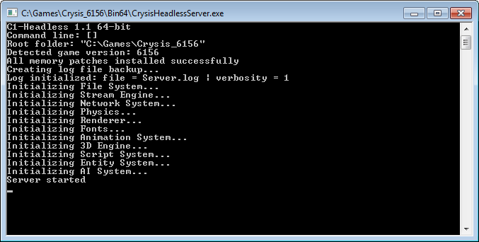

# c1-headless

C1-Headless is a Crysis dedicated server launcher without the ineffective server console window. It's based on
[c1-launcher](https://github.com/ccomrade/c1-launcher/) project and it accepts the same command line arguments as the original
dedicated server launcher. The goal is to provide a better Crysis server launcher optimized for running under Wine on Linux
servers.



### Required DLLs

32-bit version:
```
Bin32/
├── Cry3DEngine.dll
├── CryAction.dll
├── CryAISystem.dll
├── CryAnimation.dll
├── CryEntitySystem.dll
├── CryFont.dll
├── CryGame.dll
├── CryNetwork.dll
├── CryPhysics.dll
├── CryRenderNULL.dll
├── CryScriptSystem.dll
├── CrySystem.dll
├── ijl15.dll
├── IntelLaptopGaming.dll
└── msvcr80.dll
```

64-bit version:
```
Bin64/
├── Cry3DEngine.dll
├── CryAction.dll
├── CryAISystem.dll
├── CryAnimation.dll
├── CryEntitySystem.dll
├── CryFont.dll
├── CryGame.dll
├── CryNetwork.dll
├── CryPhysics.dll
├── CryRenderNULL.dll
├── CryScriptSystem.dll
├── CrySystem.dll
└── msvcr80.dll
```

### TODO

- [ ] Read console commands from standard input and execute them
- [ ] Get rid of CryRenderNULL or just disable the useless OpenGL stuff there
- [ ] Replace that horrible `ILog` implementation in CrySystem
- [x] Disable automatic creation of `gameplaystatsXXX.txt` files
- [ ] Disable `server_profile.txt` file
